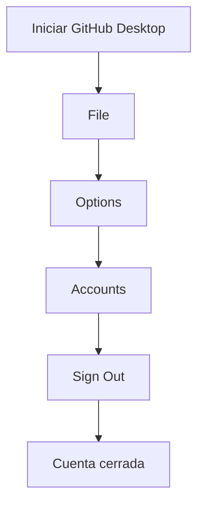
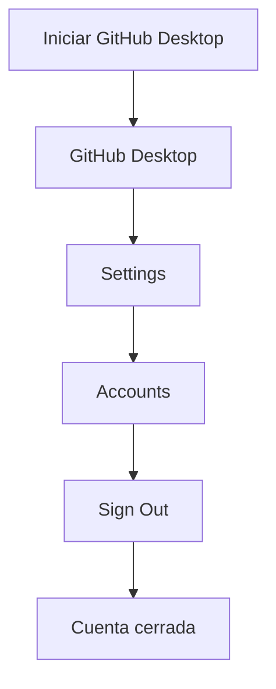
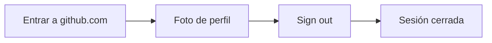

# cierra-sesion

> Un pequeño tutorial dedicado a cierta persona que decidió dejar su sesión de GitHub abierta.
> Este repositorio existe por motivos educativos y definitivamente no porque alguien olvidó cerrar sesión.

## ¿Por qué cerrar sesión?

Porque dejar una cuenta abierta en una computadora ajena puede provocar que aparezcan repositorios como este.

---

# Cerrar sesión en GitHub Desktop (Windows)

1. Abre **GitHub Desktop**.
2. En la barra superior, haz clic en **File**.
3. Selecciona **Options**.
4. Ve a la pestaña **Accounts**.
5. Haz clic en **Sign Out**.
6. Confirma la acción.

✅ Ahora tu cuenta ya no estará abierta en esa computadora.

---

# Cerrar sesión en GitHub Desktop (macOS)

1. Abre **GitHub Desktop**.
2. En la barra superior, haz clic en **GitHub Desktop**.
3. Selecciona **Settings**.
4. Ve a la pestaña **Accounts**.
5. Haz clic en **Sign Out**.
6. Confirma la acción.

✅ Tu sesión habrá sido cerrada correctamente.

---

# Bonus: cerrar sesión en GitHub Web

Si también dejaste abierta la página web:

1. Haz clic en tu foto de perfil (esquina superior derecha).
2. Selecciona **Sign out**.

---

# Lecciones aprendidas

* No dejar sesiones abiertas.
* No confiar en los compañeros.
* Revisar dos veces antes de abandonar una computadora.
* Si aparece un repositorio llamado `cierra-sesion`, probablemente llegaste demasiado tarde.
* Esta es la segunda vez que me encuentro tu cuenta, no te pases XD. 

---

## Créditos

Inspirado por un incidente real que pudo evitarse con un clic en **Sign Out** XDD.
